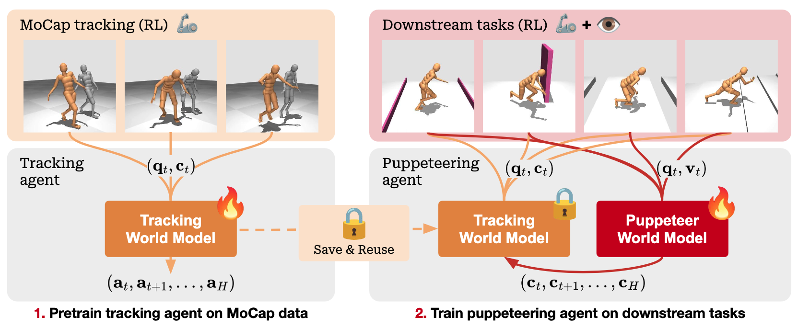

<h1>Hierarchical World Models as Visual Whole-Body Humanoid Controllers</span></h1>

Official implementation of

[Hierarchical World Models as Visual Whole-Body Humanoid Controllers](https://www.nicklashansen.com/rlpuppeteer) by

[Nicklas Hansen](https://nicklashansen.github.io), [Jyothir S V](https://jyothirsv.github.io), [Vlad Sobal](https://vladisai.github.io), [Yann LeCun](http://yann.lecun.com), [Hao Su](https://cseweb.ucsd.edu/~haosu)\*, [Xiaolong Wang](https://xiaolonw.github.io)\*<br/>
UC San Diego, NYU, Meta AI<br/>
\*Equal advising

</br>

[[Webpage]](https://www.nicklashansen.com/rlpuppeteer) [[Paper]](https://arxiv.org/abs/2405.18418) [[Models]](https://drive.google.com/drive/folders/1cgt9HzquO5mcB71Krv0C0mD10scfMquO?usp=sharing)

----

## Overview

We present Puppeteer, a hierarchical world model for whole-body humanoid control with visual observations. Our method produces natural and human-like motions without any reward design or skill primitives, and traverses challenging terrain. 

<br/>

This repository contains code for training and evaluating both low-level (tracking) and high-level (puppeteering) world models. We open-source model checkpoints for both levels of the hierarchy, so that you can get started without training any models yourself. Model checkpoints are available for download [here](https://drive.google.com/drive/folders/1cgt9HzquO5mcB71Krv0C0mD10scfMquO?usp=sharing).

----

## Getting started

You will need a machine with a GPU (>= 24 GB memory) for training; CPU and RAM usage is insignificant. We provide a `Dockerfile` for easy installation. You can build the docker image by running

```
cd docker && docker build . -t <user>/puppeteer:1.0.0
```

This docker image contains all dependencies needed for running training and inference.

If you prefer to install dependencies manually, start by installing dependencies via `conda` by running the following command:

```
conda env create -f docker/environment.yaml
```

Depending on your existing system packages, you may need to install other dependencies. See `docker/Dockerfile` for a list of recommended system packages.

----

## Supported tasks

This codebase currently supports **8** whole-body control tasks for the CMU Humanoid model, implemented in MuJoCo using DMControl. The tasks are defined as follows:

| task | vision
| --- | --- |
| stand | N
| walk | N
| run | N
| corridor | Y
| hurdles-corridor | Y
| gaps-corridor | Y
| walls-corridor  | Y
| stairs-corridor  | Y

which can be run by specifying the `task` argument for `train.py` and `evaluation.py`.

## Example usage

We provide examples on how to evaluate our provided Puppeteer model checkpoints, as well as how to train your own Puppeteer agents, below.

### Evaluation

See below examples on how to evaluate downloaded low-level and high-level checkpoints.

```
$ python evaluate.py task=corridor low_level_fp=/path/to/tracking.pt checkpoint=/path/to/corridor-1.pt
$ python evaluate.py task=gaps-corridor low_level_fp=/path/to/tracking.pt checkpoint=/path/to/gaps-corridor-1.pt
```

All high-level checkpoints were trained with the same low-level checkpoint. See `config.yaml` for a full list of arguments.

### Training

See below examples on how to train low-level and high-level world models for Puppeteer. We recommend configuring [Weights and Biases](https://wandb.ai) (`wandb`) in `config.yaml` to track training progress.

```
$ python train.py task=tracking
$ python train.py task=walk low_level_fp=/path/to/tracking.pt
$ python train.py task=corridor low_level_fp=/path/to/tracking.pt
```

We recommend using default hyperparameters for all tasks. See `config.yaml` for a full list of arguments.

----

## Citation

If you find our work useful, please consider citing our paper as follows:

```
@misc{hansen2024hierarchical,
  title={Hierarchical World Models as Visual Whole-Body Humanoid Controllers}, 
  author={Nicklas Hansen, Jyothir S V, Vlad Sobal, Yann LeCun, Xiaolong Wang, Hao Su},
  eprint={2405.18418},
  archivePrefix={arXiv},
  primaryClass={cs.LG},
  year={2024}
}
```

----

## Contributing

You are very welcome to contribute to this project. Feel free to open an issue or pull request if you have any suggestions or bug reports, but please review our [guidelines](CONTRIBUTING.md) first.

----

## License

This project is licensed under the MIT License - see the `LICENSE` file for details. Note that the repository relies on third-party code, which is subject to their respective licenses.
